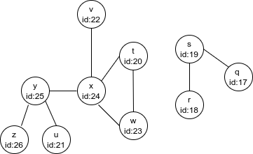

## Practica05

### INTEGRANTES

* Santiago Arroyo Lozano
* Jesús Israel Gutiérrez Elizalde
* Carlos Andrade Hernandez
* Ricardo Adrián Luévano Ballesteros

La practica se desarrolló como siempre con amor.
Nos dividimos las partes y al final revisamos el trabajo de todos

### Parte1


Creamos un método procesa_mensaje({:ya}, estado), que dado el estado de un vértice vérificamos si ya ha sido proesado o no.

Si algún vértice no ha sido procesado, significa que no ha sido visitado; entonces no está conectado y por lo tanto la gráfica no es conexa.

### Parte2

```shell
elixir src/Parte2.exs
```
