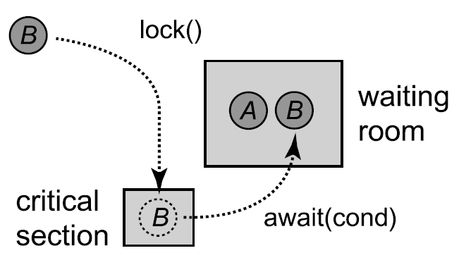
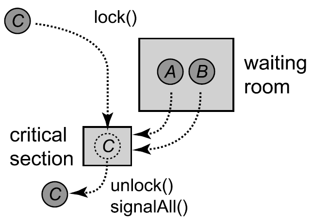
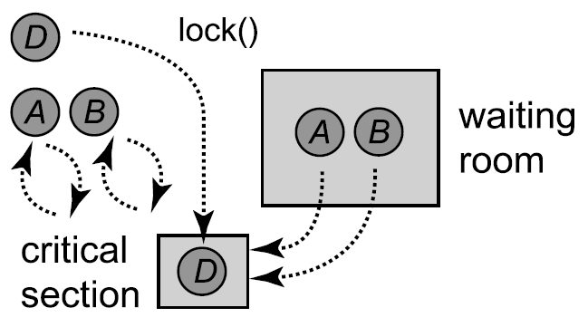

[](https://classroom.github.com/a/T6buYOAf)
[](https://classroom.github.com/open-in-codespaces?assignment_repo_id=12703509)
# Computación Concurrente - Monitors and Blocking Synchronization

## Equipo de enseñanza
* Ricchy Alaín Pérez Chevanier <alain.chevanier@ciencias.unam.mx>

## Objetivo

El objetivo de esta práctica es introducir al alumno a la solución de problemas que requieren el uso mecanismos de 
sincronización de la API de Java.

## Introducción

### Condition

Cuando un hilo está esperando que suceda un evento por un tiempo indeterminado, como que otro hilo coloque un elemento 
en una cola, este debe liberar el candado de la cola; de lo contrario, el otro subproceso nunca podrá poner en cola 
el elemento esperado. Después de que el hilo en espera haya liberado el bloqueo, necesitamos una forma de que se le 
notifique cuándo volver a adquirir el candado y volver a intentarlo.

Un objeto `Condition` asociado con un `Lock`, da la capacidad de liberar el candado temporalmente. A las condiciones a 
menudo se les denominan _variables de condición_.

Dicho lo anterior, una _condición_ está asociada con un candado y se crea llamando al método `newCondition()` del mismo. 
Si el hilo que mantiene ese bloqueo llama al método `await()` de la _condición_ asociada, libera ese bloqueo y suspende,
su ejecución; dando a otros hilos la oportunidad de adquirir el candado. Cuando el hilo que llamó `await` se despierta,
vuelve a adquirir el candado, donde puede estar compitiendo con otros hilos.

Es importante mencionar que los objetos de _condición_ deben utilizarse de forma estilizada, ya que pueden presentarse 
casos en que un hilo quiera esperar hasta que se mantenga una determinada propiedad. El hilo prueba la propiedad 
mientras mantiene el lock. Si la propiedad no se mantiene, el hilo llama `await()` para liberar el bloqueo y dormir 
hasta que otro hilo lo despierte. Sin embargo, no hay garantía de que la propiedad se mantenga cuando el hilo se 
despierta, ya que el método `await()` puede terminar sin motivo, o el hilo que señaló la condición puede haber despertado 
demasiados hilos inactivos. Cualquiera que sea la razón, el hilo debe volver a probar la propiedad, y si encuentra que 
la propiedad no se mantiene en ese momento, debe llamar al método `await()` nuevamente.

### Monitor

Un _monitor_ es una forma estructurada de combinar sincronización y datos, encapsular datos, métodos y sincronización 
en un solo paquete modular de la misma manera que una clase encapsula datos y métodos. Se puede decir que un monitor 
es la combinación de _métodos_, _locks_ de exclusión mutua y objetos de tipo _condition_. Además, exporta una colección de 
métodos, cada uno de los cuales adquiere el _lock_ cuando se llama y lo libera cuando termina.

A continuación se presenta una representación esquemática de la ejecución de un monitor.

El `thread A` ha adquirido el `lock` del monitor, y llamado `await()` en una condición, ha liberado el bloqueo y ahora está en
la sala de espera. El `thread B` luego pasa por la misma secuencia de pasos, ingresando a la sección crítica, llamando 
`await()` en la condición, abandonando el candado y entrando a la sala de espera.



Tanto `A` como `B` abandonan la sala de espera después de que el `thread C` sale de la sección crítica y llama a `signalAll()`. 
A continuación, `A` y `B` intentan volver a adquirir el bloqueo del monitor.



Sin embargo, el `thread D` logra adquirir primero el bloqueo de la sección crítica, por lo que tanto `A` como `B` giran hasta 
que `D` abandona la sección crítica. Tenga en cuenta que si `C` hubiera emitido un `signal()` en lugar de un `signalAll()`, 
solo `A` o `B` habrían salido de la sala de espera y el otro habría seguido esperando.



### Reentrant Lock

Se dice que un _Lock_ es _Reentrant Lock_ si puede ser adquirido varias veces por el mismo hilo. El paquete
`java.util.concurrent.locks` proporciona clases de candados reentrantes, por lo que en la práctica no es necesario 
escribir las nuestras.

### Semaphore

Un _Semaphore_ (semáforo en Español) es una generalización del bloqueo de exclusión mutua, donde cada uno tiene una capacidad que se determina 
cuando se inicializa el semáforo. En lugar de permitir solo un subproceso a la vez en la sección crítica, un semáforo 
**permite como máximo c subprocesos**, donde _c_ es su capacidad.

Un _semáforo_ proporciona dos métodos importantes: un hilo llama a `acquire()` para solicitar permiso de ingresar a la 
sección crítica, y `release()` para anunciar que abandona la sección crítica.

El _semáforo_ en sí mismo es solo un contador: realiza un seguimiento del número de subprocesos a los que se les ha 
otorgado permiso para ingresar. Si una nueva llamada `acquire()` está a punto de exceder la capacidad, el hilo de 
llamada se suspende hasta que haya espacio.

Cuando un hilo invoca a `release()` después de dejar la sección crítica, indica que se notifique a cualquier hilo en 
espera de que ahora hay espacio.

## Desarrollo
En esta práctica trabajarás con una base de código construida con Java 11 y Maven Wrapper,
también proveemos pruebas unitarias escritas con la biblioteca **Junit 5.7.2** que te
darán retrospectiva inmediatamente sobre el funcionamiento de tu implementación.

Para ejecutar las pruebas necesitas ejecutar el siguiente comando:

```
$ ./mvnw test
```

Para ejecutar las pruebas contenidas en una única clase de pruebas, utiliza
un comando como el siguiente:

```
$ ./mvnw -Dtest=MyClassTest test
```

Para ejecutar las pruebas que se ejecutan solamente en github, utiliza
un comando como el siguiente:

```
env ENV=github ./mvnw test 
```

En el código que recibirás la clase **App** tiene un método __main__ que puedes ejecutar
como cualquier programa escrito en __Java__. Para eso primero tienes que empaquetar
la aplicación y finalmente ejecutar el jar generado. Utiliza un comando como el que
sigue:

```
$ ./mvnw package
... o saltando las pruebas unitarias
$ ./mvnw package -DskipTests
...
...
$ ./mvnw exec:java 
```

## Configuración de los git hooks para formatear el código

Antes de empezar a realizar commits que contenga tu solución
tienes que configurar un módulo de git que te ayudará a
formatear tu código.

```
./mvnw git-code-format:install-hooks
```

## Forma de trabajo

Recomendamos ampliamente utilizar el editor [IntelliJ](https://www.jetbrains.com/help/idea/installation-guide.html)
para realizar el desarrollo de la práctica.
También agrega el plugin de IntelliJ [SonarLint](https://www.sonarsource.com/products/sonarlint/features/jetbrains/).

## Entrega

Deja todo el código con tu solución en la rama __main__, pues por omisión es esta
rama la que compara __Github Classroom__ contra la versión inicial del código mediante
el __Pull Request__ llamado __Feedback__, el cual nosotros vamos a revisar
para evaluar tu entrega.

Para verificar que tu código cumple con la especificación,
en tu __Pull Request__ debes de pasar las dos validaciones que
hace __Github Actions__ sobre el código, una de ellas verifica
que pasas las pruebas automatizadas, y la otra que hayas formateado
tu código con el plugin de maven.

Además, no olvides marcar en classroom la tarea como entregada y
en ella incluir el enlace hacia el __Pull Request__ que contiene tu
solución.

La fecha de entrega de tu práctica va a ser el máximo entre la fecha en la que
abriste el __Pull Request__ y la fecha en la que hiciste el último push al repositorio con tu
solución.

## Problemas

### [PROBLEMA 1] Savings Account (5 puntos)

Un objeto _Savings Account_ tiene en todo momento un _balance_ no negativo,
y provee 2 métodos, `deposit(amount)` y `withdraw(amount)`, donde
`deposit(amount)` agrega `amount` al _balance_ de la cuenta y
`withdraw(amount)` substrae `amount` al _balance_, si este es al menos
`amount`, en caso contrario se bloquea hasta quel _balance_ sea mayor
o igual que `amount`.

#### Especificación del programa

1. Implementa los métodos `deposit` y `withdraw` de la clase `SavingsAccountImpl` 
   utilizando __locks__ y __conditions__ para que sea _thread-safe_.
2. En esta clase existen dos tipos de _retiros_ (withdrawals), ordinarios y preferidos.
   Implementa el método `withdrawWithPreference`, de tal manera que si hay retiros pendientes 
   los retiros con preferencia tiene precedencia para ser procesados sobre los retiros 
   ordinarios.
3. Implementa el método estático `transfer(amount, srcAccount, destAccount)`, que transfiere
   `amount` de la cuenta `srcAccount` a la cuenta `destAccount`, y que es __thread-safe__.
4. Para verificar que tu implementación es correcta debes de pasar las pruebas definidas
   en la clase `SavingsAccountTest`.
5. Argumenta en tu reporte por qué tu solución es correcta y _thread-safe_.
6. Describe brevemente en tu reporte cuál es la idea de tu implementación para
   que los retiros con preferencia se resuelvan primero que los retiros ordinarios.
7. Describe en tu reporte cómo evitas que tu implementación sufra del fenómeno del
   _despertar perdido_.

### [PROBLEMA 2] RedBlueLock (5 puntos)

Los _read-write locks_ son fundamentalmente asimétricos, en el sentido
de que muchos _readers_ pueden entrar simultáneamente, pero solamente 
un _writer_ puede entrar al mismo tiempo. Diseña un protocolo simétrico
para dos tipos de hilos _rojos_(_RED_) y _azules_(_BLUE_). 
Por correctitud, nunca permitas que un hilo _rojo_ y uno _azul_ entren 
simultáneamente. 
Por progreso, permite que multiples hilos _rojos_ o _azules_ entren al mismo 
tiempo.
Para tener mecanismo de justicia simétrica, que permita que todos los
hilos tengan progreso, es decir, que si los hilos _azules_ no pueden entrar
porque hay hilos _rojos_, estos deben de eventualmente entrar también, 
y vice versa.


#### Especificación del programa

1. Implementa los métodos de la interfaz `RedBlueLock` en la clase 
   `FairRedBlueLock`. Dicha implementación además de ser correcta 
   de acuerdo a la descripción, también debe ser justa (todos progresas).
2. Para verificar que tu implementación funciona debes de pasar las 
   pruebas definidas en la clase `RedBlueLockTest`. Revisa brevemente el
   código de estas pruebas pues en ellas se varía el número de hilos que
   se utilizan de cada tipo, dependiendo de la prueba en cuestión.
3. Describe en tu reporte cómo evitas que tu implementación sufra del fenómeno del
   _despertar perdido_.
4. En tu reporte argumenta por qué tu implementación es correcta y describe con
   precisión la propiedad de justicia que garantiza tu implementación y por qué
   la utilizaste.
5. **Hint 1**: Revisa las implementaciones de `ReadWriteLock` vista en clase
   para tener una noción de cómo poder resolver este problema, ambas 
   implementaciones no tienen una espera acotada para al menos alguno de los
   tipos de hilos; por lo que es necesario extender esa idea para lograr que en
   tu solución exista algún tipo de justicia.
6. **Hint 2**: A lo largo del curso hemos visto cómo lograr justicia en algunos 
   algoritmos/protocoles de exclusión mutua, como lo son el _Algoritmo del 
   Panadero de Lamport_, o las diversas variantes de _QueueLocks_ que revisamos como _CLH_ y _MCS_,
   El _Algoritmo del Panadero_ utiliza un sistema de turnos, mientras que los _QueueLocks_
   utilizan un sistema de colas _FCFS_ para lograr justicia. Puedes reutilizar
   alguna de estas dos ideas para que tu solución también cumpla con la propiedad
   de justicia.

### [PROBLEMA EXTRA] Bounded Concurrent Buffer (2 puntos)

Implementa un _Buffer FIFO_ de _tamaño fijo_ _thread-safe_. Dicha implementación debe de satisfacer las siguientes propiedades:

* Si un hilo intenta consumir un elemento del _buffer_ mientras está vacío, este duerme y debe de esperar hasta que
  algún otro hilo ponga algo en él para poder despertar e intentar de nuevo consumir un elemento.
* Análogamente, si la cola está llena y un hilo intenta colocar un nuevo elemento en la misma, este se duerme y debe
  esperar a que espacio sea liberado en la misma para poder continuar.
* _Thread-Safe_ significa que es seguro utilizar la implementación de esta estructura utilizando varios hilos
  productores y consumidores de la misma.

Naturalmente, este problema se resuelve por medio de un candado y condiciones asociadas al mismo; sin embargo, tu solución
puede utilizar únicamente candados y semáforos.

#### Especificación del programa

1. Implementa los métodos de la interfaz `Buffer` en la clase `SemaphoresBoundedBuffer`. Para verificar que tu implementación
   funciona debes de pasar las pruebas contenidas en la clase `BufferTest`.
2. Argumenta por qué tu solución es correcta, es decir, es libre de condiciones
   de carrera y de abrazos mortales (_dead locks_).
3. Tu solución implementa algún tiempo de justicia? Argument por qué sí o por qué no
   en tu reporte.
4. **Hint 1:**: Revisa el ejemplo de productor consumidor que vimos durante la clase
   en el que resolvemos las condiciones de carrera y la disponibilidad de elementos listos
   para consumir mediante semáforos. Esta misma idea sirve para señalizar que hay espacios
   donde producir, cuando nuestro medio de producción es de tamaño acotado. Un semáforo es
   suficiente o se necesitan más?

### [PROBLEMA EXTRA] Baños Mixtos (2 puntos)

En el problema del baño compartido hay dos tipos de hilos: _HOMBRE_ y _MUJER_. Y hay un único bañ̃o que es el recurso
compartido, el cual se utiliza de la siguiente manera:

1. Exclusión Mutua: personas de sexos opuestos no pueden ocupar el baño simultáneamente.
2. Libre de hambruna débil: Asumiendo que eventualmente habrá hombres y mujeres que quieran entrar a utilizar el baño,
   todos los que necesiten utilizar el baño eventualmente lo harán.

El protocolo especifica los siguientes cuatro procedimientos:

* `enterMale()` pone en espera al hilo que lo llama hasta que este pueda entrar al baño.
* `leaveMale()` es llamado cuando un hombre sale del baño.
* `enterFemale()` y `leaveFemale()` hacen lo mismo para las mujeres.

Implementa este protocolo, puedes utilizar candados, condiciones, semáforos o alguna otra primitiva de 
sincronización que hayas desarrollado tú mismo. Explica por qué tu solución satisface
exclusión mutua y la propiedad de libre de hambruna débil.

#### Especificación del programa

* Implementa tu solución en la clase `Toilette`, puedes simular una ejecución del protocolo ejecutando las pruebas
unitarias contenidas en la clase `SimulationTest`.
