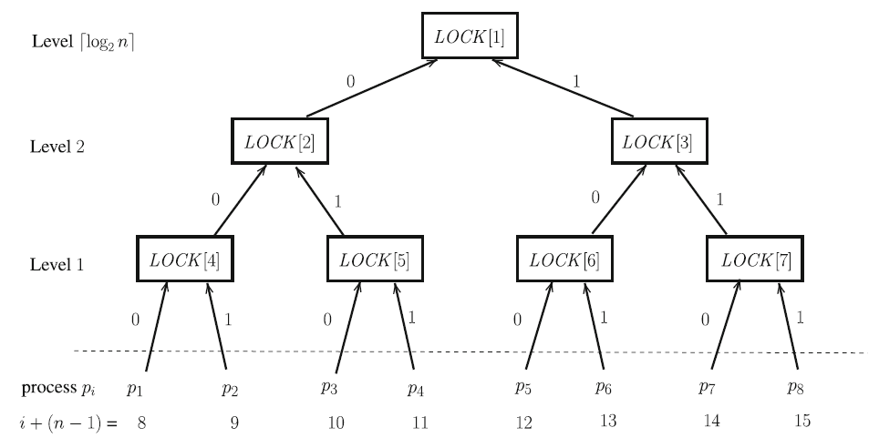

[](https://classroom.github.com/open-in-codespaces?assignment_repo_id=10661098)
# Computación Concurrente - Mutual Exclusion with ReadWrite Registers

## Equipo de enseñanza

* Ricchy Alaín Pérez Chevanier <alain.chevanier@ciencias.unam.mx>

## Objetivo

El objetivo de esta práctica es implementar algunos algoritmos de exclusión mutua para un número `N` fijo
pero arbitrario de entidades concurrentes. 

## Introducción

En esta práctica implementarás dos tipos de _locks_ para __n__ _threads_: un _TreeLock_ y 
_Lamport's Bakery Lock_.

_Lamport's Bakery Lock_ fue descrito durante la clase y _TreeLock_ utiliza _Peterson's Lock_ 
para crear un _lock_ para __n__ _threads_.

Recuerda que _Peterson's Algorithm_, como lo vimos en clase, funciona únicamente cuando a lo más dos 
_threads_ compiten por el _lock_ al mismo tiempo. Para darle la vuelta a esta limitación, podemos acomodar
instancias individuales de _Peterson Lock_ dentro de un árbol _locks_ llamado _TreeLock_, un _thread_ debe de 
adquirir todos los _Peterson locks_ en el camino desde la hoja que le corresponde hasta la raíz. Una vez
que el _thread_ adquiere el _lock_ del nodo raíz, es libre de avanzar a la _critical section_.


### Desarrollo
En esta práctica trabajarás con una base de código construida con Java 11 y Maven Wrapper, también proveemos pruebas unitarias escritas con la biblioteca **Junit 5.7.2** que te darán retrospectiva inmediatamente sobre el correcto funcionamiento de tu implementación.

Para ejecutar las pruebas unitarias necesitas ejecutar el siguiente comando:

```
$ ./mvnw test
```

Para ejecutar las pruebas unitarias contenidas en una única clase de pruebas, utiliza un comando como el siguiente:

```
$ ./mvnw -Dtest=MyClassTest test
```

En el código que recibirás la clase **App** tiene un método __main__ que puedes ejecutar como cualquier programa escrito en __Java__. Para eso primero tienes que empaquetar la aplicación y finalmente ejecutar el jar generado. Utiliza un comando como el que sigue:

```
$ ./mvnw package
... o saltando las pruebas unitarias
$ ./mvnw package -DskipTests
...
...
$ ./mvnw exec:java 
```

### Configuración de los git hooks para formatear el código

Antes de empezar a realizar commits que contenga tu solución tienes cque configurar un módulo de git que te ayudará a formatear tu código.


```
./mvnw git-code-format:install-hooks
```

## Forma de trabajo

Recomendamos ampliamente utilizar el editor [IntelliJ](https://www.jetbrains.com/help/idea/installation-guide.html)
para realizar el desarrollo de la práctica.
También agrega el plugin de IntelliJ [SonarLint](https://www.sonarsource.com/products/sonarlint/features/jetbrains/).


## Entrega

Deja todo el código con tu solución en la rama __main__, pues por omisión es esta
rama la que compara __Github Classroom__ contra la versión inicial del código mediante
el __Pull Request__ llamado __Feedback__, el cual nosotros vamos a revisar
para evaluar tu entrega.

Para verificar que tu código cumple con la especificación,
en tu __Pull Request__ debes de pasar las dos validaciones que
hace __Github Actions__ sobre el código, una de ellas verifica
que pasas las pruebas automatizadas, y la otra que hayas formateado
tu código con el plugin de maven.

Además, no olvides marcar en classroom la tarea como entregada y
en ella incluir el enlace hacia el __Pull Request__ que contiene tu
solución.

La fecha de entrega de tu práctica va a ser el máximo entre la fecha en la que
abriste el __Pull Request__ y la fecha en la que hiciste el último push al repositorio con tu
solución.

## Problemas

### TreeLock. 6 puntos

Otra manera de generizar el _Peterson Lock_ para dos hilos es organizar varios _locks_ de estos
en un árbol binario. Supón que `n` es una potencia de `2`. A cada hilo le asignamos una hoja del
árbol binario en donde tenemos un _lock_ que comparte con otro _thread_. Cada _lock_ trata a un 
_thread_ como el 0 y al otro como el 1.

En el método `acquired` del `TreeLock`, el _thread_ adquiere cada _Peterson Lock_ desde la hoja 
en la que se asignó hasta la raíz. El método `release` del `TreeLock` libera cada _Peterson Lock_ 
que ha adquirido, empezando por la raíz (el último candado que adquirió) y de regreso hacia la 
hoja donde comenzó.



Cada uno de los nodos del árbol representa un algoritmo _starvation free_, tal como el 
_Peterson Lock_ para dos hilos, que asume ser utilizado por dos procesos con identificadores 0 y 1.

La idea de este algoritmo es poner a competir los hilos y llevarlos desde las hojas hasta la raíz, 
tomando los locks de cada nodo interno. Los ganadores que toman el lock del nodo, compiten contra 
los siguientes hilos en el nodo padre, de tal forma que ahora los hilos que logran tomar el _lock_ de
un nivel, se ponen en torneo para obtener el lock del nodo siguiente.

El proceso para obtener los _locks_ se da desde las hojas hacia la raíz del árbol, pero cuando un hilo 
termina de usar la sección crítica y libera el _lock_, el proceso de `release` es inverso, es decir, 
de la raíz hacia las hojas, dando oportunidad al resto de los hilos de poder progresar hacia la raíz.

Para representar el `TreeLock`, se puede utilizar un arreglo de locks, donde el primer elemento del 
arreglo es el lock que se encuentra la raíz del árbol (empezando en el índice 1 para simplificar la 
aritmética), y dado un nodo arbitrario con índice `x`, sus hijos se encuentran en los índices 
`2x`(hijo izquierdo) y `2x + 1`(hijo derecho).

#### Especificación del programa

Para este ejercicio implementa las clases

* `PetersonLock`: aquí necesitarás implementar una ligera variación del algoritmo, pues no utilizarás el `threadId` 
  como índice del arreglo de flags, si no un `lockId` derivado del mismo, pues por ejemplo si tenemos 8 hilos, en el 
  `lock` raíz, los hilos `0`, `1`, `2` y `3` les corresponde el `lockId -> 0` mientras que a los hilos `4`, `5`, `6` y 
  `7` les corresponde el `lockId -> 1`. Adicionalmente al crear este tipo de `lock`, vamos a pasar información del nivel
  del árbol en el que vamos a colocar, además de la cantidad total de hilos que lo van a usar, esta información debería 
  de ser suficiente para inferir el `lockId` que debemos de asignar a cada hilo.
* `PetersonTreeLock`: la única información adicional que necesitamos para crear una instancia de esta clase es el 
  número de hilos que lo van a utilizar, pues esto te ayuda a crear el árbol de locks utilizando un arreglo.
* `PetersonTreetLockHelper`: implementar esta clase es opcional, puedes apoyarte en ella para calcular dos puntos 
  esenciales del `TreeLock`, primero para calcular el `lockId` que utilizas en el algoritmo de 
  Peterson para dos hilos, y segundo para calcular el índice del lock dentro del arreglo de índices. Esta clase asume 
  que el nivel 0 corresponde a la raíz del árbol, sus hijos izquierdo y derecho están en el nivel 1, y así 
  sucesivamente. Las pruebas unitarias de esta clase asumen que los niveles así se representan.
* `ThreadID`: las pruebas unitarias asumen que utilizas los ids que genera esta clase para los hilos que estas generan.

Para verificar que tu implementación funciona correctamente, necesitas pasar las pruebas unitarias contenidas 
en las clases

* `PetersonLockTest`
* `PetersonTreeLockHelperTest`: es opcional pasar estas pruebas, pero pueden servir como guía y apoyo para 
  realizar algunos cálculos necesarios para implementar el `TreeLock`. Para activar la ejecución de estas 
  pruebas necesitas cambiar el valor de `tree-lock-helpers.enabled` a `true` en el archivo 
  `src/test/resource/application.properties`
* `PetersonTreeLockTest`

#### Preguntas

* Argumenta si la implementación de este lock es libre de hambruna.
* Con tus propias palabras explica qué tan bueno es este algoritmo en términos de contención 
  y coherencia de cachés.

### Lamport's Bakery Algorithm. 4 puntos

Revisar la descripción en los slides del curso. Pseudocódigo a continuación:

```java
class BakeryLock {
  boolean[] flag;
  Label[] label;
  
  Bakery (int threads) {
    flag = new boolean[threads];
    label = new Label[threads];
    for(int i = 0; i < threads; i++) {
      flag[i] = false;
      label[i] = 0;
    }
  }

  void acquire () {
    flag[threadId] = true;
    label[threadId] = max(label[0],...,label[N-1]) + 1;
    while(∃ k:flag[k] && (label[k],k) < (label[threadId], threadId)) {}
  }
  
  void release () {
    flag[threadId] = false;
  }
}
```

#### Especificación del programa

Para este ejercicio implementa las clases:

* `LamportBakeryLock`
* `ThreadID`: las pruebas unitarias asumen que utilizas los ids que genera esta clase para los hilos que estas generan.

Para verificar que tu implementación funciona correctamente, necesitas pasar las pruebas unitarias contenidas
en las clases

* `LamportBakeryLockTest`
#### Preguntas
* Con tus propias palabras explica qué tan bueno es este algoritmo en términos de contención
  y coherencia de cachés. 
* Hay alguna manera de mejorar el rendimiento haciendo uso inteligente _cache lines_ de la computadora?
* Cómo hiciste para asegurar que se cumpla la relación _happens-before_ es las escrituras a los arreglos
  de flag y label?

### [PROBLEMA EXTRA] Semáforo mediante el Algoritmo del Filtro. 3 puntos

Modifica la implementación del algoritmo visto en clase para que este funcione como un semáforo.

#### Especificación del programa

* Implementa la clase `FilterSemaphoneImpl`. 
* Para verificar que tu solución funciona debes de pasar las pruebas unitarias contenidas en la clase
  `SemaphoreTest`. Para activar la ejecución de estas pruebas necesitas cambiar el valor de 
  `filter-semaphore.enabled` a `true` en el archivo `src/test/resource/application.properties`.

#### Preguntas
* Describe brevemente qué modificaste en el algoritmo para lograr el cambio.
* Con tus propias palabras explica qué tan bueno es este algoritmo en términos de contención
  y coherencia de cachés. 
* Hay alguna manera de mejorar el rendimiento haciendo uso inteligente _cache lines_ de la computadora?
